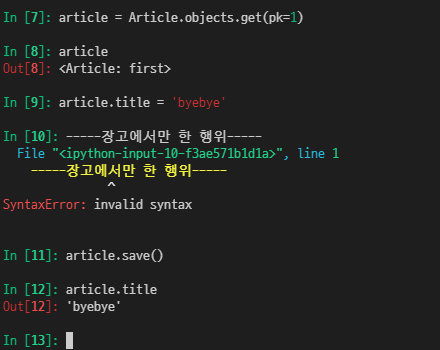

# Djanog CRUD

대부분의 컴퓨터 소프트웨어가 가지는 기본적인 데이터 처리 기능

Create Read Update Delete

<br>

<br>

## 1. CREATE

- 첫 번째 방식

  ```bash
  article = Article()
  
  article.변수명 = 값
  
  article.save() 저장!!
  ```

  

  cf)

  

  장고는 id보다 pk로 접근 하는 것을 권장(short cut임)

  

- 두 번째 방식

  

- 세 번째 방식

  인스턴스 생성은 안하면서 값은 바로 저장하는 

  

  반환 값으로 저장되는 것의 pk를 돌려줌

   

  a convenience method for creation an object and saving it all in one step.

<br>

- 결과


<br>

<br>

### save() method

객체를 데이터베이스에 저장함

객체의 id 값이 무엇인지 알 수 없음

db에 저장되어야 계산이 되기 때문에

단순히 모델을 인스턴스화 하는 것은(선언만 하는 것은) 디비에 영향을 미치지 않기 때문에 반드시 저장을 해야함

<br>

<br>

cf)


값 편하게 보기위한 표현

여기서는 왜 마이그레이션 그거 안하냐!!

**데이터베이스에 영향을 주는 요소가 아님 즉 설계도가 아니라는 것**

<br>

<br>

<br>

## 2. READ

cf) QuerySet API metho는 크게 2가지 종류

return new querysets ex) all

do not return querysets ex) create

#### all() 전체 조회

 ```bash
 Article.objects.all()
 ```

현재 QuerySet의 복사본 반환

<br>

<br>

#### get() 일부 조회

```bash
Article.boject.get(pk=1)
```


주어직 lookup 매개변수와 일치하는 **객체를 반환**

조회를 했는데 찾을 수 없으면 DoesNotExist 예외를 발생

둘 이상의 객체를 찾으면 MultipleObjectReturned 예외를 발생

### 고유한 한 개를 찾는데 사용해야함


요렇게 변수를 만들기 위한 것 처럼 사용 할 수도 있음

<br>

<br>

### filter()

주어진 lookup 매개변수와 일치하는 객체를 포함하는 새 QuerySet을 반환


새 쿼리 셋을 반환하기에 없는 값은 None을 반환

<br>

<br>

<br>

## 3. UPDATE

### 업데이트를 위해서는 조회하는 것이 먼저!!



<결과>


갱신하는 시간도 함께 바뀜

<br>

<br>

<br>

## 4.  DELETE

뭘 삭제할지 정하고 삭제!


삭제되고 딕셔너리 반환되고!!

<br><br>

`Q : 삭제된 자리 1은 어떻게 될것인가? 번호를 다시 쓸까? 아니면 4번으로 될까?`

`A : 다시 쓰지 않음`

> 삭제되었다는 것은 앞으로는 디비에서 불필요한 정보라는 것을 의미
>
> 만약에 중간 중간에 삭제 되었다면 비어 잇는 자리 검색해서 사용하게되는…


<br>

<br>

<Br>

## Admin

서버 관라지가 활용하는 페이지

```bash
python manage.py createsuperuser
```

```python
# articles/admin.py
admin.site.register(Article)
```

