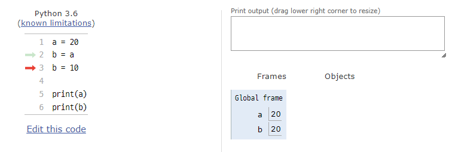
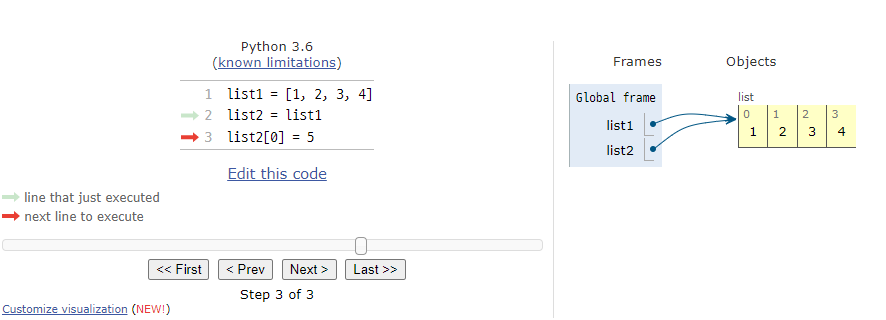
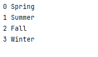

#  컨테이너

여러 개의 값을 저장할 수 있는 것(객체)

- 시퀀스형: 순서가 있는 데이터, 정렬되어 있지는 않음
- 비시퀀스형 : 순서가 없는 데이터

|              시퀀스형              |   비시퀀스형    |
| :--------------------------------: | :-------------: |
| List, Tuple, Range, String, Binary | Set, Dictionary |


## 시퀀스형

리스트, 튜플, 레인지, 활용 함수


#### 1. 리스트(List)

**같은 성질을 가지는 것들을 모음**

class type list

- 리스트는 순서가 있는 시퀀스로 인덱스를 통해 접근

  

- 대괄호 [] 혹은 list()를 통해 생성

  ```python
  iamlist = [1,2,3]
  iamlisttoo = list((1,2,3))
  ```

- 리스트 접근

  ```python
  iamlist[index]
  ```


- 리스트의 장점은 서로 다른 타입의 데이터를 저장

  ```python
  iamlist = ['1',2,[3,4],{'key':'value'}]
  ```

  리스트 안에 다른 리스트 혹은 다른 타입의 데이터를 저장할 수 있습니다.

  위의 리스트는 String, Int, List, Dictionary로 이루어진 하나의 List 입니다.


#### 2. 튜플(Tuple)

**튜플은 수정 불가능한(immutable) 시퀀스이며 인덱스로 접근**

class type tuple

- 소괄호 () 혹은 tupler()을 통해 생성

  ```python
  iamtuple = (1,2,3)
  iamtypletoo = tuple((1,2,3,4))
  ```

  

- 튜플 접근

  ```python
  iamtuple[index]
  ```

  

- 튜플을 immutable! 다른 값으로 변경(할당)시 TypeError 발생!!

  

- 일반 적으로 파이썬 내부에서 활용됨

  - mutiple assignment

    ```python
    x, y = 1, 2 #값을 수정할 수 없다는 특징을 활용
    x, y = y, x
    ```

  - 함수에서 복수의 값을 반환하는 경우 

    ```python
    x ,y = divmod(5,2)
    #아래와 같이 동작하는 divmod()
    x, y = 5//2, 5%2
    ```

    divmod(a,b) : a를 b로 나눈 몫과 나머지를 반환 

    

- 하나의 항목으로 구성된 튜플은 생성시 값 뒤에 쉼표를 붙여야함

  ```python
  iamtuple = (1,) #class tuple
  ianint = (1) #class int
  ```

  


#### 3. 레인지(Range)

**숫자의 시퀀스(순서)를 나타내기 위해 사용**

class type Range

- 기본형 range(n)

  0부터 n-1까지의 숫자 시퀀스

- 범위 지정 range(n, m)

  n부터 m-1까지의 숫자 시퀀스

- 범위 및 스텝 지정 range(n, m, s)

  n부터 m-1까지 s만큼 증가시키며 숫자 시퀀스

  ```python
  range(4) # 0~3까지 값 반환
  list(range(4)) # 0~3까지 값을 반환하여 리스트에 바로 저장
  ```


list(range(4))로 list를 만들 수 잇으나 반복문 같은 경우에는 Index 참조를 위한 range(4) 정도로 사용가능


## 시퀀스에서 활용하는 연산자/ 함수

- 시퀀스 포함 여부

  - in 
  - not in

  ```python
  4 in (1,2,'hi') #False
  -3 in range(3) #False
  'a' in 'apple' #True
  ```


- '+'

  시퀀스 간의 concatenation(연결)

  range는 TypeError 발생

  ```python
  sequence + sequence
  ```

  

- '*'

  시퀀스를 반복

  range는 TypeError

  ```python
  sequence * int
  ```

  시퀀스 내부의 값을 곱하는 것이 아니며 시퀀스 자체를 여러번 반복합니다


- 인덱싱(indexing)

  시퀀스의 특정 인덱스 값에 접근

  ```python
  sequence[index]
  ```

  해당 인덱스가 없는 경우IndexError

  

- 슬라이싱(slicing)

  시퀀스를 특정 단위로 슬라이싱

  ```python
  sequence[start : end : step] #동작은 range와 같음
  ```

  

- 길이

  시퀀스의 길이

  len(sequence)

  ```python
  len(range(100)) # return 100
  len('apple') # return 5
  len((1,2,3)) # return 3
  ```

  

- 최소/ 최대

  시퀀스에서의 최솟/최댓값

  ```python
  max((range(-100, 2))) # return 1
  min('abcd1234%^!') # return '!'
  ```


- count(value)

  시퀀스에서의 특정 원소의 개수를 반환

  단, 존재하지 않을 시 0을 반환

  ```python
  [1,2,1,2,4].count(1) # return 2
  range(5).count(5) # return 0
  ```

  


## 비시퀀스형

세트, 딕셔더리


#### 1. 세트(Set)

**순서가 없는 자료구조**

class type Set

- 중괄호 {} 혹은 set()을 통해 생성

  ```python
  {1,2,3,1,2} # return {1, 2, 3} 중복 값 제거
  
  ### 차이 구분하기
  iamset = set() # 빈 set 생성
  iamDict = {} # 빈 Dictionary를 생성!! Not empty Set!!!!
  ```

  빈 세트를 만들기 위해서는 set()을 반드시 활용

  

- 순서가 없어 별도의 값에 접근 할 수 없음

  ```python
  {1,2,3}[1] # False
  ```


- 수학에서의 집합과 동일한 구조를 가짐

  ```python
  set_a = {1,2,3}
  set_b = {3,,6,9}
  
  print(set_a - set_b) # return {1,2}
  print(set_a | set_b) # return {1,2,3,6,9} |은 보통 bit단위의 or 나타내지요! 비슷한 느낌
  print(set_a & set_b) # return {3} &은 보통 bit 단위의 and 연산이지요~
  ```

  

  

- 세트를 활용하면 다른 컨테이너에서 중복된 값을 쉽게 제거할 수 있음

  단, 이후 순서가 무시되므로 순서가 중요한 경우 사용할 수 없음

  ```python
  my_list = [1,1,2,3,1,2,4,4]
  len(set(my_list)) # return 4
  set(my_list) # return {3,2,4,1} 순서가 아에 사라짐 새로 정리되는 규칙도 보이지 않음
  ```


#### 2. 딕셔너리(Dictionary)

**key와 value가 쌍으로 이뤄진 자료구조**

class dict

- 중괄호 {} 혹은 dict()를 통해 생성

  ```python
  iamdict = {'key' : 'value'}
  iamdicttoo = dict()
  ```


- key를 통해 value에 접근

  ```python
  dict_a = {'a':'apple','list':[1,2,3]}
  dict_a['list']  # return [1,2,3]
  ```


- key는 변경 불가능한 데이터(immutable)만 활용 가능

  string, integer, float, bollean, tuple, range


- value는 모든 값으로 설정 가능(리스트, 딕셔너리 등)


## 컨테이너 분류

변경 불가능한 데이터, 변경 가능한 데이터


#### 1. 변경 불가능한 데이터(Immutable)

- 리터럴(literal)
  - 숫자(number)
  - 문자(string)
  - 참/거짓(bool)
- ragne
- tuple





b = a를 하면 같은 값이 공유


#### 2. 변경 가능한 데이터(mutable)

- list
- set
- dictionary




list2 = list1을 하는 경우 동일한 리스트의 주소를 참조하고 있어

list2[0] = 5로 변경하게 되면 해당 list1// list2의 첫번째 원소 값이 변경됨(얕은 복사)

이후 데이터 구조 항목에서 설명


# 정리

|               | Sequence                 | Non-Sequence      |
| ------------- | ------------------------ | ----------------- |
| **Immutable** | String // Tuple // Range |                   |
| **Mutable**   | List                     | Set // Dictionary |


# 추가

- List Vs Dict

  구분 할 때 내가 보는 것이 무엇인지 자세하게 보자!!

  ```python
  print(type(list))
  print(type(dict))
  ```

  위를 활용하여 천천히 확인하면서 접근


- for의 활용 차이

  for i in range(len(numbers)) Vs for i in numbers

  - 전자
    1. len(numbers) : numbers의 길이를 알게된다
    2. range(numbers의 길이) : numbers의 길이 만큼 for문을 반복

  주로 인덱스를 참조할 때 활용

  

  - 후자

    numbers 안에 있는 데이터 값을 활용

  

  좋아 그러면 enumerate()를 한번써봐~


- `enumerate`(*iterable*, *start=0*)

  iterable한 객체를 index와 value를 동시에 (tuple 형태로) 반환해준다!

  ```python
  seasons = ['Spring', 'Summer', 'Fall', 'Winter']
  for index, value in enumerate(seasons):
      print(index,value)
  ```

  



참조

https://docs.python.org/ko/3/library/functions.html#enumerate