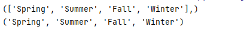
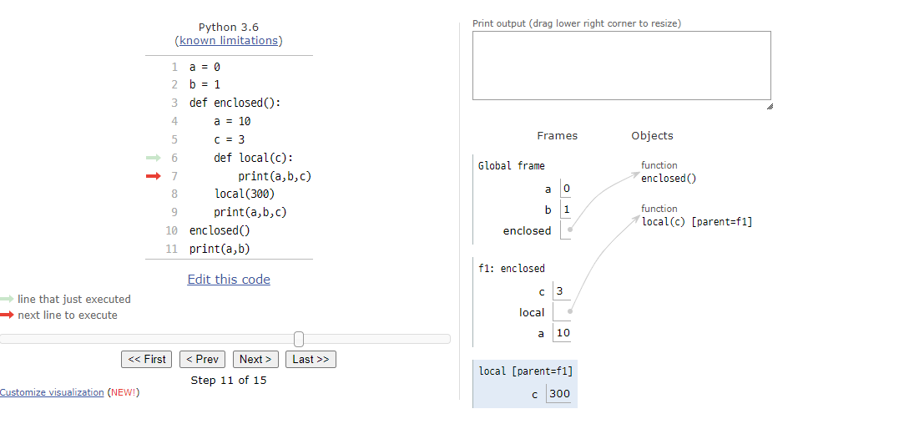

# 함수

**특정한 기능을 하는 코드의 조각**

프로그램을 여러 부분으로 나누어 여러 상황에서 사용할 수 있는 높은 재사용성을 가짐

나누어진 부분은 수정하기 쉬어 유지보수가 용이함


## 함수의 기초

구성요소

- 이름
- 매개변수(parameters)
- 바디(body) - Doctstring(optional) 및 코드셋
- 반환값(return)

```python
def function(parameters):
    """
    Doctsring
    """
    body
    
    return 
    
```


#### Doctstring

**함수나 클래스의 설명**

- 선택적인 사항이며 함수의 Body앞에 기술해야함

- shift + tab || function_name.\__doc__ 으로 확인 가능


#### 내장 함수(Built-in Functions)

파이썬에는 많은 함수와 형이 내장되어 있음


참조

https://docs.python.org/ko/3/library/functions.html


#### 1. 함수의 선언 및 호출

**함수를 사용하기 위한 사전 작업**


- 함수의 선언

  ```python
  def function(parameter):
      """
      doctstring
      """
      
      #body
      
      return
  ```

  함수의 실행될 코드 블록을 작성함

  함수는 매개변수를 넘겨줄 수도 있음

  함수는 동작 후에 return을 통해 결과 값을 전달함

  ### 반드시 하나의 객체를 반환


- 함수의 호출

  ```python
  function(argument)
  ```

  함수는 함수명()으로 호출

  매개변수가 있는 경우 인자를 전달


#### 2. 함수 Output

**항상 반환되는 값이 있으며, 어떠한 객체라도 상관 없음**

오직 한 개의 객체만 return 됨


`Q1. 복수의 객체를 반환하는 경우?`

`A1. 그래도 하나의 객체를 반환한다!!`

```python
def fun(p1,p2):
    return p1+p2, p1-p2

fun(1,2)
"""
(3,-1)
"""
```

>fun 함수처럼 p1+p2, p1-p2의 값을 반환하는 경우
>
>(3, -1)을 반환한다
>
>이것은 tuple로 이루어진 하나의 객체를 반환한다는 것을 의미한다
>
>tuple이 파이썬 내부에서 주로 사용된다! 라는 것을 설명할 수 있다

`Q2. 명시적인 반환 값이 없는 경우?`

`A2. None이 반환된다`

```python
def hello():
    print('hello world')
    
hello()
"""
hello world
"""
#None
```

>hello 함수안에 print()을 하여 출력을 하지만
>
>hello 함수를 통해 return을 통해 값이 반환 된 것은 없다
>
>반환되는 값이 없다면 None이 반환된다


#### 3. 함수 Input

**정의된 함수 외에 외부에서 전달된 값**


- 위치 인자(Positional Arguments)

  기본적으로 함수 호출 시 인자는 위치에 따라 함수 내에 전달됨

  ```python
  def add(x, y):
  	return x+y
  	
  add(2, 3)
  ```

  add(2, 3)이 전달이 되었는데 위치에 따라 x = 2 // y = 3으로 전달이 됨

  

- 기본 인자 값(Default Arguments Values)

  기본값을 지정하여 함수 호출 시 인자 값을 설정되어 있지 않을 시 해당 값으로 설정이 됨

  ```python
  def add(x, y=0)
  	return x+y
  
  add(2)
  ```

  add(2)로 x = 2만 전달이 되었는데 y 변수는 전달 된 값이 없다

  하지만 기본 인자 값이 설정되어 있기 때문에 y = 0으로 저장이 된다.

  

  

- 키워드 인자(keyword Argument)

  직접 변수의 이름으로 특정 인자를 전달할 수 있음

  ```python
  def add(x,y):
  	return x+ y
  	
  add(x=2, y=5) # return 7
  add(2, y=5) # return 7
  add(x=2,5) # Fales
  ```

  ### 키워드 인자 다음에 위치 인자를 활용할 수 없다

  3번째 add함수의 경우 add(키워드인자, 위치인자)로 인자가 전달이 되었다.

  

- 가변 인자 리스트(Arbitraty Argument Lists)

  함수가 임의의 개수 인자로 호출될 수 있도록 지정

  인자들은 튜플로 묶여 처리되며, 매개변수에 *을 붙여 표현

  ```python
  def add(*args):
      for arg in args:
          print(arg)
      
  add(2,3,4,5)
  ```

  

- 가변 키워드 인자(Arbitray Keyword Arguments)

  함수가 임의의 개수 인자를 키워드 인자로 호출될 수 있도록 지정

  인자들은 딕셔너리로 묶여 처리되며, 매개변수에 **를 붙여 표현

  ``` python
  def family(**kwargs):
      for key, value in kwargs:
          print(key,":",value)
          
  family(father='john',mother='jane',me='john Jr.')
  ```


- 언패킹 (*)

  여러 가변 인자 리스트 혹은 가변 키워드 인자로 값이 전달될 때 *을 붙이면 전달되는 값이 풀려져서 함수에 전달이 된다.

  ```python
  seasons = ['Spring', 'Summer', 'Fall', 'Winter']
  # for index, value in enumerate(seasons):
  #     print(index,value)
  
  
  def function(*args):
      print(args)
  
  
  function(seasons)
  function(*seasons)
  ```

  




#### 매개변수(Parameter) Vs 인자(Argument)

- 매개변수 : 함수의 입력으로 전달된 값을 받는 변수

  ```python
  def my_func(a,b)
  #a, b 가 매개 변수
  ```

- 전달인자 : 함수를 호출할 때 함수에 전달하는 입력 값

  ```python
  my_func(1,2)
  #1, 2 가 전달인자
  ```

  


#### 주의

`CASE 1` 정의 시 주의사항

```python
def function(para1 = 'hi',para2)
```

### 기본 인자 값(para1)을 가지는 인자 다음에 기본 값이 없는 인자로 정의 할 수 없음


`CASE 2` 호출 시 주의 사항

```python
add(x=3, 5)
```

### 키워드 인자 다음에 위치 인자를 활용할 수는 없음


## 함수 Scope

**함수는 코드 내부에 지역 스코프(local scope)를 생성하며, 그 외의 공간인 전역 스코프(global scope)로 구분**


- 스코프
  - 빌트인 스코프 : 파이썬이 실행된 이후부터 영원히 유지
  - 전역 스코프 : 코드 어디에서든 참조할 수 있는 공간
  - 지역 스코프 : 함수가 만든 스코프. 함수 내부에서만 참조 가능
- 변수
  - 전역 변수 : 전역 스코프에 정의된 변수
  - 지역 변수 : 지역 스코프에 정의된 변수


#### 이름 검색 규칙(Name Resolution)

파이썬에서 사용되는 이름들은 이름공간(namespace)에 저장되어 있음

LEGB Rule이라고 불림

- Local scope : 함수 
- Enclosed scope : 특정 함수의 상위 함수
- Global scope : 함수 밖의 변수, inmport 모듈
- Built-in scope : 파이썬 안에 내장되어 있는 함수 또는 속성

### 즉, 함수 내에서는 바깥 스코프의 변수에 접근 가능하나 수정은 할 수 없음




1. a = 0, b = 1로 변수 지정 (global scope)

2. enclosed()실행

   a = 10 c = 3 지정 (local scope)

3. local(300)실행이 되면서 300을 전달

   print()문이 실행이 되는데 

   a = 10(Enclosed scope), b, = 1(global scope), c = 100(local scope)으로 실행이된다

4. local()이 종료되고 enclosed()의 print()문이 실행

   a = 10(local scope), b = 1(global scope), c = 3(local scope)

5. enclosed() 함수가 종료되고 외부 print()문 실행

   a = 0, b = 1


#### Global

현재 코드 블록 전체에 적용되며, 나열된 식별자들이 전역 변수임을 나타냄

- global에 나열된 이름은 같은 코드 블록에서 global 앞에 등장할 수 없음
- 나열된 이름은 매개변수, for 루프 대상, 클래스/ 함수 정의 등으로 정이 하지말자!!!


#### nonlocal

전역을 제외하고 가장 가까운 스코프의 변수를 연결하도록 함

- nonlocal에 나열된 이름은 같은 코드 블록에서 nonlocal 앞에 등장할 수 없음
- nonlocal에 나열된 이름은 매개변수, for 루프 대상, 클래스/ 함수 정의 등으로 정의 하지말자!!


안쓰는게 나을 것 같습니다!


#### 주의

파이썬은 함수만! 스코프를 가진다 if / for 등은 없다!!!


좋은 함수 정의 구조

```python
my_info(x, y, *args, **kwargs)
```


## 재귀 함수(Recursive Function)

**자기 자신을 호출하는 함수**

무한한 호출을 목표로 하는 것이 아니며, 알고리즘 설계 및 구현에 유용하게 활용

1개 이상의 base case(종료되는 상황)가 존재하고, 수렴하도록 작성


#### 반복문 Vs 재귀 함수

- 반복문

  n이 1보다 큰경우 반복문 실행, n은 1씩 감소

  마지막에 n이 1이면 더 이상 반복문을 돌지 않음

- 재귀 함수

  재귀 함수를 호출하며, n은 1씩 감소

  마지막에 n이 1이면 더 이상 추가 함수를 호출하지 않음

