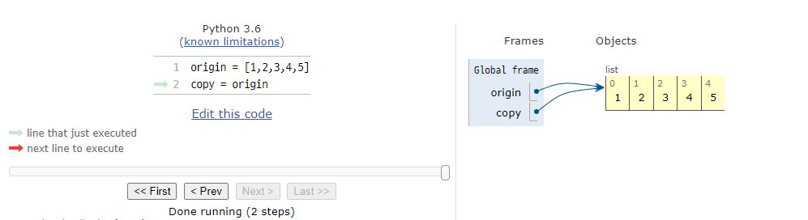
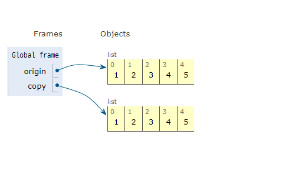
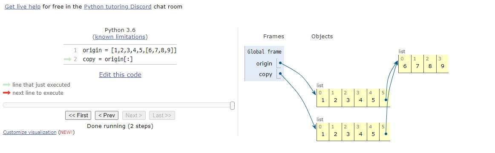
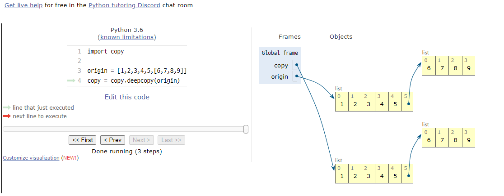

# 데이터 구조

**데이터에 편리하게 접근하고, 변경하기 위해 데이터를 저장하거나 조작하는 법**

문자열 리스트 세트 딕셔너리

메서드 Vs 함수

```python
class ABC():
	def Method():
		pass

def Function():
	pass
```

함수에 대괄호[] 가 있다면 선택적인 인자!(문서 표현 방식)

## 문자열

**문자들의 나열**

변경할 수 없고(Immutable) 순서가 있고(ordered) 순회 가능한(iterable)


#### 문자열 인덱스

| 'ABC' |  A   |  B   |  C   |
| :---: | :--: | :--: | :--: |
| index |  0   |  1   |  2   |
| index |  -3  |  -2  |  -1  |


#### 1. 문자열 자르기(Slicing)

String[start : stop : step]


```python
s = 'abcdefghi'

s[::] # return 'abcdefghi'

s[::-1] # return 'ihgfedcba'
```


#### 2. 문자열 조회/탐색

- .find(value) : x의 첫 번째 위치를 반환. 없으면, **-1을 반환함**
- .index(value) : x의 첫 번째 위치를 반환. 없으면, **오류 발생**(ValueError)


#### 3. 문자열 변경

- .replace(old, new[, count]) : 바꿀 대상(old)를 새로운 글자(new)로 바꿔서 (복사본)**반환**

  ​												count를 지정하면 해당 개수만큼만 시행

- .strip([chars]) : 특정한 문자들을 지정하면 양쪽제거(strip), 왼쪽제거(lstrip),오른쪽제거(rstrip)

- .split([chars]) : 문자열을 특정한 단위로 나눠 **리스트로 반환**

- 'separator'.join([iterable]) : 반복가능한 컨테이너 요소들을 구분자로 함쳐 문자열 반환

  

- .capitalize() : 앞글자를 대문자로 나머지는 소문자로 **반환**

- .title() : ' 나 공백 이후를 대문자로 **반환**

- .upper() : 모두 대문자로 **반환**

- .lower() : 모두 소문자로 **반환**

- .swapcase() : 대 <=> 소 문자로 변경하여 **반환**


- .isalpha() : 알파벳 문자 여부
- .isupper() : 대문자 여부
- .islower() : 소문자 여부
- .istitle() : 타이틀 형식 여부('나 공백 이후 대문자)


## 리스트

**순서가 있는 시퀀스**

변경 가능하고(mutable) 순서가 있고(ordered) 순회 가능한(iterable)


#### 1. 값 추가 및 삭제

- .append(value) : 리스트의 끝에 값 추가

- .extend(iterable) : 리스트에 iterable의 항목을 추가함

  

- .insert(index, value) : 정해진 위치 index에 value를 추가함

  ​										len()으로 길이를 재서 넣어도 가능

  ​										인덱스가 넘어버리면 맨 끝에 추가 되지만 좋지 못한 선택

  

- .remove(value) : 리스트에서 값이 value 인 것 삭제 // **원본 변경하고 삭제**

- .pop(index) : index 위치에 있는 값을 삭제하고 그 항목을 **반환**

  ​						i가 지정되지 않으면, 마지막 항목을 삭제하고 **반환**

  

- .clear() : 모든 항목을 삭제함


#### apend vs extend

append : 넣는 값 그대로 넣음 즉, 리스트든 딕션이든 그대로 넣어버림

extend : 붙여주는 역할 즉, 연결 +=와 동일

​				단, 하나의 항목(coffee)를 입력하게 되면 쪼개서 'c' 'o' 'f' 'f' 'e' 'e' 를 추가

#### remove Vs pop

remove : 원본 변경하고 삭제

pop : 항목을 삭제하고 반환


#### 2. 탐색 및 정렬

- .index(value) : value 값을 찾아 해당 index 값을 **반환**
- .count(value) : value의 개수를 **반환**
- .sort() : 원본 리스트를 절렬함. **None 반환** 

- .reverse() : 순서를 반대로 뒤집음(정렬 X)


#### sort Vs sorted

sort : 원본 리스트를 정렬함 **None을 반환**

sorted : 정렬 **리스트를 반환. 원본 변경 X**


|                | sort//reverse | sorted//reversed |
| -------------- | ------------- | ---------------- |
| 종류           | 메서드        | 함수             |
| 원본 변경 여부 | 원본 변경 O   | 원본 변경 X      |
| 반환 여부      | 반환 X        | 반환 O           |

ed는 원본은 변경하지 않기에 반환

ed가 없는 것은 원본을 변경하기 때문에 반환 X


#### 3. 리스트 복사



origin 의 값을 copy가 복사 한 것 처럼 보이지만 주소를 복사하는 구조임


**얕은 복사(shallow copy)**



```python
origin = [1,2,3,4,5]
copy = origin
```


- Slice 연산자를 활용

  ```python
  copy = origitn[:]
  ```

- list()를 활용

  ```python
  copy = list(origin)
  ```


#### 얕은 복사의 주의 사항



리스트 안의 리스트 처럼 복사하는 원소가 주소를 참조하는 경우 얕은 복사가 함께 일어남


#### 깊은 복사

```python
import copy

copy = copy.deepcopy(origin)
```




#### 4. List comprehension

표현식과 제어문을 통해 특정한 값을 가진 리스트를 생성하는 법

```python
[<expression> for <변수> in <iterable>]
[<expression> for <변수> in <iterable> if <조건식>]
```


#### 5. Bulit-in Function

- map(function, iterable)

  class type map

  순회 가능한 데이터구조의 모든 요소에 함수 적용하고, 그 결과를 map object로 반환

  ```python
  n, m = map(int, input().split())
  ```

  띄워쓰기로 (split)로 입력된(input) 두 개의 값을 숫자형으로(int)변환하여 n , m에 저장


- filter(function, iterable)

  class type filter

  순회 가능한 데이터 구조의 모든 요소에 함수 적용하고 그 결과가 **True**인 것들을 filter object로 반환


- zip(*iterables)

  복스의 iterable을 모아 튜플을 원소로 하는 zip object를 반환


#### 주의 사항

map // filter // zip 은 각각의 type object로 반환을 하기 때문에 형변환을 해서 사용해줘야함


## 세트

**중복 없이 순서가 없는 데이터 구조**

변경가능하고(mutable) 순서가 없고(unordered) 순회 가능한(iterable)

- .add(elem) : 세트에 값을 추가
- .update(*others) : 여러 값을 추가
- .remove(elem) : 세트에서 삭제하고, 없으면 **KeyError**
- .discard(elem) : 세트에서 삭제하고 없어도 **에러가 발생하지 않음**
- .pop() : 임의의 원소를 제거해 반환


## 딕셔너리

**Key와 Value로 구성된 데이터 구조**

변경 가능하고(mutable) 순서가 없고(unordered) 순회 가능한(iterable)


#### 1. 추가 및 삭제

- .get(key[, default]) : key를 통해 value를 가져옴 // KeyError가 발생하지 않으며 default 값을 설정할 수 있음

- .pop(key[, default]) : key가 딕셔너리에 있으면 제거하고 해당 값을 **반환** 그렇지 않으면 default 값을 **반환**

  ​									default 값이 없으면 KeyError

- .update() : 값을 제공하는 key, value로 덮어씁니다


#### 2. 딕셔너리 순회

- keys() : Key로 구성된 결과
- values() : Value로 구성된 결과
- items() : (Key, Value)의 튜플로 구성된 결과


#### 3. Dictionary Comprehension

```python
{key : value for <변수> in <iterable>}
{key : value for <변수> in <iterable> if <조건식>}
```

