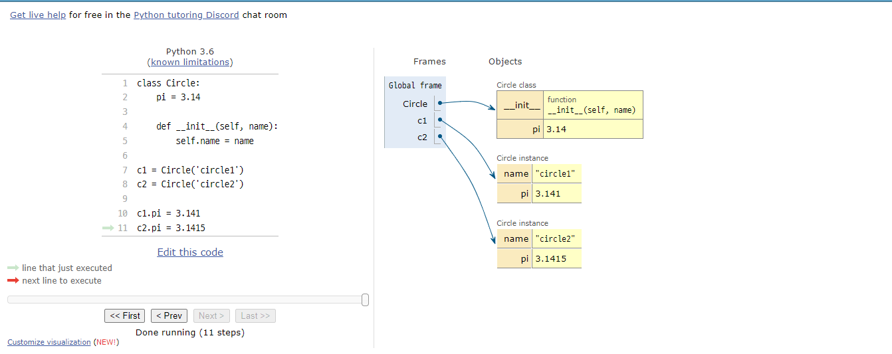

# OOP

Object-Oriented Programming


## 객체

**객체 : 세상에 존재하는 모든 것**

```python
my_lower('Hi') Vs 'Hi'.lower()
sorted([3,2,1]) Vs [3,2,1]
```

전자 : 데이터(객체)가 인자로서 들어가서 함수가 데이터를 처리

후자 : 데이터(객체)가 메서드를 호출

### 파이썬은 모두 객체로 이루어져 있다!

### 객체는 특정 타입의 인스턴스 이다!!

> 123, 900, 5 는 모두 int의 인스턴스
>
> 'hello', 'bye' 는 모두 string의 인스턴스
>
> [232, 89, 1 ] []은 모두 list의 인스턴스


- 객체의 특징

  타입 : 어떤 연산자와 조작이 가능한가?

  속성 : 어떤 상태(데이터)를 가지는가?

  조작법 : 어떤 행위(함수)를 할 수 있는가?


```python
print(type('1')) # return <class 'str'>
str(1) # '1'은 string라는 클래스! 생성된 str의 인스턴스!!
```


#### 1. is(instance)

객체 확인 함수

- is 

  객체의 아이덴티티를 검사하는 연산자

  ```python
  type(1) is int # return True
  type(0) in bool # return False
  ```

- isinstance(object, classinfo)

  객체(object)가 뒤의 클래스에서 만들어진 인스턴스 //서브클래스냐? 일치하면 True

  ```python
  isinstance(10, int) # return True
  isinstance(10, (bool, in, complex)) # return True tuple 형식이라면 하나라도 일치한다면
  isinstance(0,(bool, 'hi', comples)) # return False 'hi'는 type의 형태가 아님
  ```


#### 2. 객체 속성/메서드

- \<object>.\<attribute> : 속성은 객체의 상태/데이터
- \<object>.\<method>() : 메서드는 특정 객체에 적용될 수 있는 행위를 뜻하며, 일반적으로 **클래스에 정의된 함수**


#### == VS is

== :동등한(equal)

변수가 참조하는 객체가 동등한(내용이 같은) 경우 True

두 객체가 같아 보이지만 실제로 동일한 대상을 가리키고 있다고 확인해 준 것은 아님


is : 동일한(identical)

두 변수가 동일한 객체를 가리키는 경우 True


## Object Vs Class Vs Instance

객체 : 현실 세계의 모든 것

클래스 : 컴퓨터 세계(현실세계-객체)를 컴퓨터 세계로 보내기 위한 설계도

인스턴스 : 설계도(클래스)로 만든 컴퓨터 상의 실체


`CASE `

> class Person() : # 설계도
>
> 데이터 (이름, 키, 나이, 취미) # 속성
>
> 행동(밥, 잠, TV보기) #메서드


## 객체 지향 프로그래밍

**객체 지향 프로그래밍은 컴퓨터 프로그램을 명령어의 목록으로 보는 시각에서 벗어나 여러 개의 독립된 단위 즉, '객체'들의 모임으로 파악하고자 하는 것**


#### 1. 클래스와 인스턴스

클래스도 누군가의 클래스이다

Type MetaClass = 모든 클래스의 어머니 //호출한다면 재귀적으로 MetaClass를 재호출

```python
class MyClass: #클래스 정의
    pass
my_instance = MyClass() #인스턴스 생성
my_instance.my_method() # 메서드 호출
my_instance.my_attribute # 속성
```


- 속성 : 특정 데이터 타입/클래스의 객체들이 가지게 될 상태/데이터를 의미
- 메서드 : 특정 데이터 타입/클래스의 객체에 공통적으로 적용 가능한 행위


#### 2. self

인스턴스 자기자신

파이썬에서 인스턴스 메서드는 호출 시 첫번째 인자로 인스턴스 자신이 전달되게 설계


`Q. self가 뭐죠`

`A. 자기 자신을 호출하는 건데`

> 'apple'.capitalize() # 축약형(객체지향적) (1)
>
> str.capitalize('apple') # 실제 동작하는 형태 (2)
>
> 이 갭을 메꾸는게 self
>
> self가 없다면 절대로 인스턴스가 메서드를 호출할 수 없음 (1) 이 불가능
>
> self가 없다면 class가 메서드를 호출하면서 인자를 인스턴스로 전달해야함 (2) 로 호출해야함


#### 3. 생성자(constructor)

인스턴스 객체가 생성될 때 호출되는 메서드

```python
__init__(self)
```


#### 4. 소멸자(destructor)

인스턴스 객체가 소멸(파괴)되기 직전에 호출되는 메서드


#### 5. 매직 메서드

\__(Double underscore)가 있는 메서드는 특수한 동작을 위해 만들어진 메서드

\__str\__(self) // \__len__(self) // \__repr__(self) 등등


## 클래스와 인스턴스

#### 1. 변수

- 인스턴스 변수 = 인스턴스의 속성

  메서드에서 self.\<name>으로 정의

  인스턴스가 생성된 이후 \<instance>.\<name>으로 접근 및 할당

  ```python
  class Person:
      def __init(self, name):
          self.name = name # 인스턴스 변수 정의
  saram = Person('muyaho') # 인스턴스 변수 할당
  saram.name # 인스턴스 변수 접근
  ```

- 클래스 변수 = 클래스의 속성

  모든 인스턴스가 공유

  클래스 선언 내부에서 정의

  \<classname>.\<name>으로 접근 및 할당

  ```python
  class Person:
  	name = 'noname' # 클래스 변수 정의
  Person.name # 클래스 변수 접근
  ```

  

  

#### 2. 인스턴스와 클래스 간의 이름 공간

클래스와 인스턴스 각각 공간 생성 접근 순서

인스턴스 => 클래스 (역으로 불가능)




클래스와 인스터스별 이름 공간이 분리 됨

pi는 클래스 변수이지만 인스턴스가 새롭게 pi로 인스턴스 변수를 생겨서 관리

### 접근 순서가 인스턴스 -> 클래스 이기 때문에 사용한다면 인스턴스 변수를 사용하게됨 권장하지 않음!!

원치 않는 동작이나 버그를 유발할 수 있음


#### 3. 메서드

- 인스턴스 메서드

  인스턴스가 사용할 메서드

  호출 시, 첫번째 인자로 인스턴스 자기자신(self)이 전달됨

  ```python
  class MyClass:
  	def iam_instance_method(self):
  		pass	
  ```

  ### 인스턴스가 사용하서 인스턴스 내부의 값을 변경하기 위해 사용하는 것

  

- 클래스 메서드

  클래스가 사용할 메서드

  @classmethond 데코레이터를 사용하여 정의

  호출 시, 첫번째 인자로 클래스(cls)가 전달됨

  ```python
  class MyClass:
      @classmethod
      def iam_class_method(cls):
          pass
  ```

  ### 클래스가 사용하고 클래스 내부의 값을 변경하기 위해서 사용하는 것

  

- 스태틱 메서드

  클래스가 사용할 메서드

  @staticmethod 데코레이터를 사용하여 정의

  호출 시, 어떠한 인자도 전달되지 않음(클래스 정보에 접근/ 수정 불가)

  ```python
  class MyClass:
      @staticmethod
      def iam_static_method():
          pass
  ```

  ### self, cls 가 전달되지 않음

  

  

  #### 정리

  인스턴스는 3가지 메서드 다 접근 가능하다 하지만 사용한다는 아니다!

  클래스는 클래스/스태틱 메서드 접근가능

  > 속성에 접근을 하냐 안하냐에 따라 메서드를 따로 호출해서 사용
  >
  > 즉, 접근해서 사용하면 클래스메서드 안하면 스태틱 메서드

  

  #### 스태틱 메서드는 언제 사용해야 할까?

  `Q1. 스태틱 메서드는 self, cls 인자를 취하지 않기 때문에 사용에 제약이 있어보임`

  `A1. 하지만 반대로 특정한 메서드가 주변의 다른 것들과 독립적일 수 있다는 것을 의미`

  

  `Q2. 그럼 언제사용함?`

  `A2. 개발자의 의도를 전달하는 동시에 개발자 의도를 강제해 버그로 인해 설계를 깨드리지 않도록 함`

  

  `Q3. 어떻게 강제함?`

  `A3. self, cls 인자를 전달하지 않기 때문에 객체 인스턴스, 클래스 상태에 접근 할 수 없음`

  

  `Q4. 다른 건?`

  `A4. 객체 지향 프로그래밍과 절차 지향 프로그래밍 스타일 사이를 연결 하는 역할을 하기도 함`

  `별도의 연산을 한다든지, 테스트 코드를 작성한다든지 코드의 유지 보수를 하는데 도움을 줄 수 있음`

  

  

## 상속

**상속 관계를 이용하면 코드의 재사용성이 높아짐**

클래스는 상속이 가능함

모든 파이썬 클래스는 object를 상속 받음


- isinstance(object, classinfo)
- issubclass(class, classinfo)


#### 1.super()

자식 클래스에서 부모 클래스를 사용하고 싶은 경우

```python
class Parent():
    def __init__(self,name):
		self.name = name
        
class Child(Parent):
    def __init__(self,name,age):
        #Parent 클래스
        super().__init__(name) # 부모클래스 생성자 그대로 사용
        self.age = age
```


#### 2. 메서드 오버라이딩

상속 받은 메서드를 재정의하여 같은 이름의 메서드로 덮어씀

부모 클래스의 메서드를 실행시키고 싶은 경우 super를 활용

```python
class Parent():
    def __init__(self,name):
		self.name = name
        
	def greeting(self):
        print('hi son')
        
    def bye(self):
        print('good night')
        
class Child(Parent):
    def __init__(self,name,age):
        #Parent 클래스
        super().__init__(name) # 부모클래스 생성자 그대로 사용
        self.age = age

	def greeting(self):
        print('hi dad')
        
    def bye(self):
        super().bye
        print('mom')
```


이름공간은 인스턴스 -> 자식클래스 -> 부모클래스 순으로 탐색


#### 3. 다중 상속

두 개 이상의 클래스를 상속 받는 경우

```python
class Dad():

class Mom():

class Child(Dad,Mom)
```


만약 같은 변수명이나 메서드를 사용한다면 순서대로 Dad -> Mom 순으로 접근하여 사용한다


